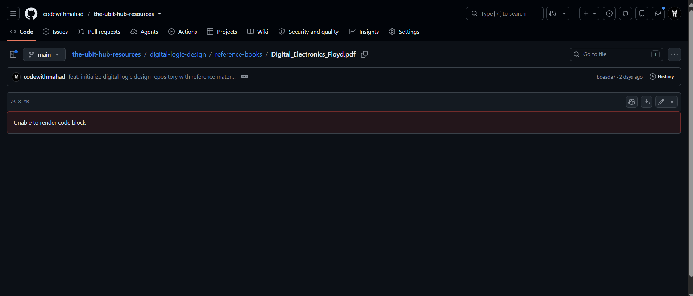

<div align="center">

# 🏛️ The UBIT Hub Resources

**The central academic archive for University of Karachi (UBIT) students.**

<br>

<a href="https://github.com/codewithmahad"></a>

<a href="https://github.com/codewithmahad/the-ubit-hub-resources/stargazers"></a>

</div>

---

## Why This Exists

Every semester, students produce great notes and solve difficult assignments. The moment finals end, most of that material disappears into old WhatsApp groups and never resurfaces. The next batch starts from zero and repeats the same cycle.

This repository breaks that cycle. It is a permanent, structured archive where any UBIT student can find exactly what they need — organized by course, labeled clearly, and maintained consistently. The long-term goal is to cover every major course across semesters so that no student has to scramble for resources before an exam again.

---

## Courses Available

Each course folder has its own `README.md` — open it first. It maps out every file inside and tells you exactly how to study using the available resources.

<br>

<table>
  <thead>
    <tr>
      <th align="left" width="260">Course</th>
      <th align="left">What's Inside</th>
      <th align="center" width="90">Status</th>
    </tr>
  </thead>
  <tbody>
    <tr>
      <td><strong><a href="./software-requirement-engineering">Software Requirement Engineering</a></strong><br><sub><code>/software-requirement-engineering</code></sub></td>
      <td>Typed notes · Handwritten notes · Course outline · 3 reference textbooks · 4 extracted chapters</td>
      <td align="center"></td>
    </tr>
    <tr>
      <td><strong><a href="./digital-logic-design">Digital Logic Design</a></strong><br><sub><code>/digital-logic-design</code></sub></td>
      <td>Handwritten notes · MCQ bank · Final exam target guide · Floyd textbook · 8 extracted chapters</td>
      <td align="center"></td>
    </tr>
    <tr>
      <td><strong><a href="./linear-algebra">Linear Algebra</a></strong><br><sub><code>/linear-algebra</code></sub></td>
      <td>Semester notes (Miss Fozia Hanif) · Lecture questions</td>
      <td align="center"></td>
    </tr>
    <tr>
      <td><strong><a href="./communication-and-presentation-skills">Communication & Presentation Skills</a></strong><br><sub><code>/communication-and-presentation-skills</code></sub></td>
      <td>Resources being compiled.</td>
      <td align="center"></td>
    </tr>
  </tbody>
</table>

<br>

> More courses will be added as they are covered. Star the repository to stay updated.

---

## How to Use This Repository

```
1. Pick your course from the table above and click into its folder.
2. Open the README.md inside that folder — read it before anything else.
3. Start with the notes, cross-reference with extracted chapters when needed.
4. Use the full textbooks only for deep dives or end-of-chapter problems.
```

### ⚠️ Downloading PDFs — Read This First

GitHub is a code platform. It cannot preview large PDF files in the browser. If you open a PDF and see a red **"Unable to render code block"** banner — **the file is not broken.** 

Click the **Download** button (↓) in the top-right corner of the file viewer to save it to your device.

<div align="center">
  
  <br>
  <sub>When you see this error, simply click the download icon highlighted above.</sub>
</div>

---

## Contributing

If you have high-quality notes or solved assignments that would benefit other students, contributions are welcome.

| Rule | Detail |
|------|--------|
| **File Naming** | Use the format: `CourseName_ResourceType_YourName.pdf` |
| **Quality** | Only upload clean, readable, and complete material. |
| **Scope** | Notes and study guides only. No academically restricted material. |
| **Process** | Fork → Add your files → Open a Pull Request with a clear description. |

---

## About the Maintainer

<table>
  <tr>
    <td align="center" width="110">
      <a href="https://github.com/codewithmahad">
        
      </a>
    </td>
    <td>
      <strong>Shaikh Mahad Ud Din</strong> — Backend Developer & UBIT Student<br>
      <sub>Java · Spring Boot · REST APIs · PostgreSQL · C++ / DSA</sub><br><br>
      <a href="https://github.com/codewithmahad"></a>
      <a href="https://github.com/codewithmahad"></a>
    </td>
  </tr>
</table>

<br>

<div align="center">
  <sub>If this repository saved you time before an exam, a ⭐ on the repo goes a long way.</sub><br><br>
  <a href="https://github.com/codewithmahad/the-ubit-hub-resources/stargazers">
    
  </a>
</div>
