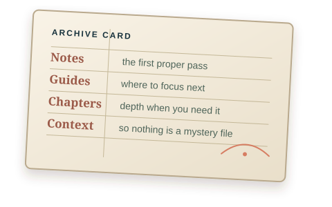
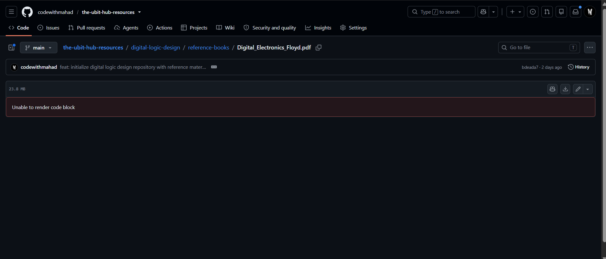

  

  <a href="#the-shelves">Browse the shelves</a>
  &nbsp;&nbsp;·&nbsp;&nbsp;
  <a href="#a-better-way-to-use-the-archive">How to use it</a>
  &nbsp;&nbsp;·&nbsp;&nbsp;
  <a href="#add-to-the-shelf">Contribute</a>

> **A good set of notes should outlive the semester.**

Finals finish, groups go quiet, and useful material gets buried in old chats and unnamed drives. Then the next batch starts searching for the same things again.

This is the shelf I wanted to exist: course material kept in one place, named clearly, and explained before you open the first PDF. Start with the README inside the course folder. It tells you what the files are, where to begin, and when a textbook chapter is worth your time.

 

## The shelves

There are **5 course folders**, **31 PDFs**, and one DLD logic-gates reference sheet here so far. Each shelf has its own map. The archive will grow course by course, only when material can be labeled well enough for someone else to use it without guessing.

| Course | Start here | On the shelf |
| :-- | :-- | :-- |
| **[Software Requirement Engineering](./software-requirement-engineering/)** | Course outline, then the comprehensive notes | 11 PDFs: typed and handwritten notes, three references, and focused chapters |
| **[Digital Logic Design](./digital-logic-design/)** | Final Exam Target Guide | 13 PDFs: notes, MCQ bank, Floyd chapters, and a logic-gates sheet |
| **[Linear Algebra](./linear-algebra/)** | Complete semester notes | 1 complete set of lecture notes by Miss Fozia Hanif |
| **[Communication & Presentation Skills](./communication-and-presentation-skills/)** | Complete notes | 3 PDFs: course notes plus Murphy and Guffey references |
| **[Urdu](./urdu/)** | Comprehensive notes | 3 PDFs: notes, ghazals, and selected prose chapters |

 

## A better way to use the archive

<table>
  <tr>
    <td width="33%" valign="top"><strong>01 · Orient yourself</strong> Open the course README first. It is the map, not decoration.</td>
    <td width="33%" valign="top"><strong>02 · Learn from the primary notes</strong> Use the compiled or handwritten notes for the first proper pass.</td>
    <td width="33%" valign="top"><strong>03 · Reach for depth on purpose</strong> Open extracts and full textbooks only when a topic needs more explanation or practice.</td>
  </tr>
</table>

That order keeps a 900-page book from becoming your first obstacle. It also makes the archive useful whether you are revising early, catching up mid-semester, or trying to make the final week less chaotic.

<strong>A PDF will not preview on GitHub?</strong>

Some larger PDFs trigger GitHub's red “Unable to render code block” message. The file is still there. Use the download button in the file viewer to save it locally.

  

## Add to the shelf

If you have notes, an assignment guide, a clean MCQ bank, or a resource that helped you understand a course, it may save the next person the same late-night search.

Before opening a pull request, keep it simple:

- Put the file in the right course folder and give it a clear, searchable name.
- Add it to that course’s README with one honest sentence about what it contains.
- Share clean, complete material that students can actually study from.
- Do not add restricted exam material, mystery files, or duplicates.

The full process, naming examples, and rules are in [CONTRIBUTING.md](./CONTRIBUTING.md).

## Keep the shelf useful

This archive is not trying to be a dump of every PDF ever forwarded in a class group. The useful parts are the context, the course maps, and the decision to keep the next student from starting at zero.

If one of these folders saves you time before an exam, a [star](https://github.com/codewithmahad/the-ubit-hub-resources/stargazers) is a quiet way to say the next shelf is worth building. You can follow [codewithmahad](https://github.com/codewithmahad) to see it grow.

  
   
  Maintained by <a href="https://github.com/codewithmahad">Shaikh Mahad Ud Din</a> · <a href="./CONTRIBUTING.md">Contributing guide</a> · <a href="./LICENSE">MIT License</a>

