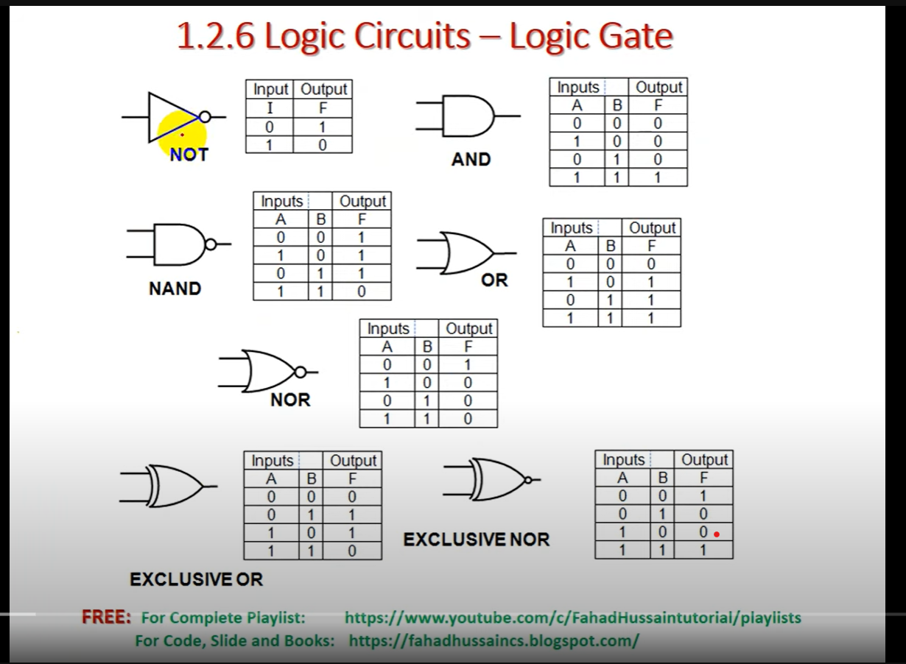

  <h1>Digital Logic Design (DLD)</h1>
  <strong>Comprehensive Learning & Revision Repository</strong>

---

> **Digital Logic Design** is the foundational course for understanding how computers and digital systems operate at the hardware level. It covers everything from basic binary number systems and logic gates to the design of complex combinational and sequential circuits. This repository centralizes all the necessary reading materials, structured notes, and practice resources to streamline learning and exam preparation.

## Core Topics Covered

Based on the standard DLD curriculum, the materials in this repository cover:
- **Foundations**: Number Systems, Operations, and Codes.
- **Basic Logic**: Logic Gates, Boolean Algebra, and Logic Simplification (K-Maps).
- **Combinational Logic**: Combinational Logic Analysis and Functions of Combinational Logic (Adders, Multiplexers, Decoders).
- **Sequential Logic**: Latches, Flip-Flops, Timers, Shift Registers, and Counters.

---

## Repository Architecture

This directory is logically organized to separate practice material, student-curated notes, and heavy reference textbooks. 

### Core Practice Material

| Resource | Description | Type |
|----------|-------------|------|
| **[DLD MCQs Bank](./DLD_MCQs_Bank.pdf)** | A comprehensive collection of Multiple Choice Questions for quick testing and exam preparation. | `Practice` |

---

## Study Materials

### Handwritten Notes
Scanned, complete physical notes taken during lectures, offering detailed examples, K-map simplifications, and in-class problem-solving.

* **[DLD Handwritten Notes (Shaikh Mahad)](./handwritten-notes/DLD_Handwritten_Notes_ShaikhMahad.pdf)**
* **[DLD Handwritten Notes (Classmate)](./handwritten-notes/DLD_Handwritten_Notes_Classmate.pdf)**

### Standard Reference Textbooks
The official recommended textbook for deep-dives into specific topics.

| Title | Author | File |
|-------|--------|------|
| **Digital Fundamentals** | Thomas L. Floyd | [`View PDF`](./reference-books/Digital_Electronics_Floyd.pdf) |

---

## Extracted Chapters (Quick Revision)

To avoid navigating massive textbook PDFs during revision, core chapters from Floyd's *Digital Fundamentals* have been extracted for focused reading.

<b>Click to view available chapter extracts</b>

 

**Thomas L. Floyd:**
- **[Chapter 02: Number Systems, Operations, and Codes](./reference-books/extracted-chapters/Floyd_Chapter_02_Number_Systems_and_Codes.pdf)**
- **[Chapter 03: Logic Gates](./reference-books/extracted-chapters/Floyd_Chapter_03_Logic_Gates.pdf)**
- **[Chapter 04: Boolean Algebra and Logic Simplification](./reference-books/extracted-chapters/Floyd_Chapter_04_Boolean_Algebra.pdf)**
- **[Chapter 05: Combinational Logic Analysis](./reference-books/extracted-chapters/Floyd_Chapter_05_Combinational_Logic.pdf)**
- **[Chapter 06: Functions of Combinational Logic](./reference-books/extracted-chapters/Floyd_Chapter_06_Functions_of_Combinational_Logic.pdf)**
- **[Chapter 07: Latches, Flip-Flops, and Timers](./reference-books/extracted-chapters/Floyd_Chapter_07_Latches_and_FlipFlops.pdf)**
- **[Chapter 08: Shift Registers](./reference-books/extracted-chapters/Floyd_Chapter_08_Shift_Registers.pdf)**
- **[Chapter 09: Counters](./reference-books/extracted-chapters/Floyd_Chapter_09_Counters.pdf)**

---

## Cheatsheets & Visual Guides

A quick reference for standard logic gates and their corresponding truth tables.

  

---

## Useful Links & Tools

* **[Karnaugh Map Solver](https://karnaughmapsolver.com/)**: An excellent interactive tool for practicing K-map groupings and verifying your Sum of Products (SOP) or Product of Sums (POS) simplifications.

---

## Recommended Study Flow

1. **Primary Learning:** Use the `Handwritten Notes` as your baseline. They condense complex circuit designs into understandable steps.
2. **Cross-Reference:** When a concept (like a specific K-map grouping or Flip-Flop excitation table) feels unclear, consult the specific `Extracted Chapter` for the foundational theory.
3. **Deep Dive:** Only open the full `Reference Books` when you need further context or end-of-chapter problems outside of the extracted chapters.
4. **Test Yourself:** Run through the `MCQs Bank` to validate your understanding before exams.

---

  <i>Open Resource for Digital Logic Design Students</i>

